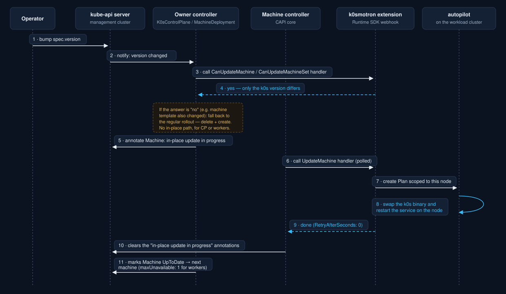

k0smotron v2.1.0 is out. Alongside a batch of fixes and dependency bumps, this release closes a gap that's been open for a while: **in-place upgrades, now also available for worker nodes**. Check the [full changelog](https://github.com/k0sproject/k0smotron/releases/tag/v2.1.0) for everything included. This post focuses on the in-place upgrade story, where we came from and what changes now.

## In-place upgrades, before v2.1.0

k0smotron has supported in-place upgrades for control plane nodes for a while, through `spec.updateStrategy: InPlace` on `K0sControlPlane`. This is a standalone mechanism: the control plane controller detects a k0s version change, builds an autopilot `Plan` targeting the control plane nodes that require a k0s version update, and lets [autopilot](https://docs.k0smotron.io/) roll out the new k0s version without replacing the underlying machine. No CAPI involvement beyond the control plane controller itself.

The catch is that this only ever covered control plane machines, because worker nodes in a CAPI-managed cluster are owned by the Machine controller (a core CAPI controller), so k0smotron had no way to apply that same in-place approach to worker updates. Prior to v2.1.0, bumping a worker's k0s version simply flowed into CAPI's regular machine rollout: new machines provisioned, old ones drained and deleted, regardless of whether you actually wanted or needed a new machine.

## Closing the gap with Cluster API's own mechanism

Cluster API's Runtime SDK lets external code participate in decisions that would otherwise be entirely internal to a core controller: a **Runtime Extension** is just a webhook server that implements one or more well-known hook contracts, and CAPI calls out to it at specific points during reconciliation, letting the response steer what happens next. It's the general escape hatch CAPI provides for "let something outside core have a say here" situations.

[Cluster API v1.12](https://www.kubernetes.io/blog/2026/01/27/cluster-api-v1-12-release/) added a new hook contract built on top of that mechanism, for in-place updates, fully described in the [in-place updates proposal](https://github.com/kubernetes-sigs/cluster-api/blob/main/docs/proposals/20240807-in-place-updates.md) and the [Runtime Extension implementation guide](https://cluster-api.sigs.k8s.io/tasks/experimental-features/runtime-sdk/implement-in-place-update-hooks). It's made up of three hooks: `CanUpdateMachine` and `CanUpdateMachineSet` ask the available/deployed runtime extensions whether a pending spec change can be applied to a machine without recreating it, and `UpdateMachine` does the actual work, polled until it reports completion. If nothing implements the contract, or the extensions can't cover the full change, CAPI just falls back to its regular immutable rollout.

k0smotron v2.1.0 ships a Runtime Extension implementing exactly that contract, backed by [autopilot](https://docs.k0sproject.io/head/autopilot/): on `UpdateMachine`, it creates a `Plan` scoped to that single node and watches it to completion.

It only kicks in once three things are true: 
- Cluster API core `v1.12.0` or newer.
- The `InPlaceUpdates` feature gate enabled on CAPI core and in k0smotron.
- K0smotron's extension installed:

```shell
kubectl apply --server-side=true -f https://docs.k0smotron.io/v2.1.0/install-extension-webhook.yaml
```

If any of the three is missing, k0smotron transparently falls back to the standalone path: control plane nodes keep upgrading the standalone in-place upgrade mechanism, and workers fall back to the regular CAPI rollout (delete + create). Either way, this only ever covers the k0s version running on a node, changes to machine templates or bootstrap configuration still force a recreate. Both the CAPI feature gate and the k0smotron extension are marked experimental for now, so expect some rough edges.

The diagram below is the shared shape of the protocol, referenced by step number in the two walkthroughs that follow:



### Updating a control plane

The field to touch hasn't changed: `spec.version` on `K0sControlPlane`, with `spec.updateStrategy: InPlace` (the default):

```yaml
apiVersion: controlplane.cluster.x-k8s.io/v1beta2
kind: K0sControlPlane
metadata:
  name: my-kcp
spec:
  version: v1.31.3+k0s.0 # bumped
  updateStrategy: InPlace
```

Once that's applied, here's what happens, matching the step numbers in the diagram:

1. The operator bumps `spec.version` on the `K0sControlPlane`, which is written to the kube-api server.
2. The kube-api server notifies the `K0sControlPlane` controller of the change.
3. The controller calls `CanUpdateMachine` on the k0smotron extension.
4. The extension answers yes, only the k0s version differs.
5. The controller annotates the `Machine`, via the kube-api server, with the annotation that triggers and tracks the in-place update.
6. The core CAPI machine controller, watching that `Machine`, sees the pending hook and starts polling `UpdateMachine` on the extension.
7. The extension creates an autopilot `Plan` scoped to that one node.
8. Autopilot swaps the k0s binary and restarts the service on the node.
9. The extension reports back that it's done.
10. The machine controller writes back to the kube-api server, clearing both annotations.
11. The `K0sControlPlane` controller sees the machine is ready, marks it `UpToDate`, and moves on to the next one, one machine at a time.

### Updating worker machines

Same idea, different object: bump `spec.template.spec.version` on the `MachineDeployment` with `maxUnavailable: 1` (it can't be `0`):

```yaml
apiVersion: cluster.x-k8s.io/v1beta2
kind: MachineDeployment
metadata:
  name: my-md
spec:
  rollout:
    strategy:
      rollingUpdate:
        maxSurge: 1
        maxUnavailable: 1 # required for in-place updates, cannot be 0
  template:
    spec:
      version: v1.31.3+k0s.0 # bumped
```

The sequence is the same, with one addition specific to workers: a `MachineDeployment` normally rolls out changes by creating a new `MachineSet` and scaling the old one down, and a `MachineSet`'s template is otherwise immutable. So between steps 4 and 5, the `MachineDeployment` controller first hands the `Machine` off from the old `MachineSet` to the new one instead of deleting and recreating it, a small annotation-driven dance of its own that's spelled out in full in the [proposal](https://github.com/kubernetes-sigs/cluster-api/blob/main/docs/proposals/20240807-in-place-updates.md). Step 3 uses `CanUpdateMachineSet` instead of `CanUpdateMachine`, and step 11's "next machine" respects `maxUnavailable: 1`. Everything else, the annotations in step 5, the `UpdateMachine` polling loop, the per-node `Plan`, is identical to the control plane case.

## Why in-place matters for worker nodes specifically

Replacing a node during an upgrade is usually a non-issue for stateless, fungible workers. But it stops being free the moment a node is expensive or slow to recreate, and worker fleets hit that case far more often than control planes do:

- **GPU and other accelerator nodes.** Nodes carrying non-standard resources like GPUs aren't usable out of the box, they need to be prepared first: install the driver, run a [device plugin](https://kubernetes.io/docs/tasks/manage-gpus/scheduling-gpus/) to register the hardware as a schedulable resource, optionally let Node Feature Discovery label it. Replacing the node means redoing that preparation from scratch, plus re-pulling any large image layers, before it's schedulable again. GPU capacity is also usually the scarcest and priciest thing in the cluster, so pulling a node out of the pool to replace it, rather than patching it in place, directly costs scheduling capacity for accelerator-bound workloads.
- **Edge and bare-metal deployments.** When a "worker node" is a physical box at a remote site, "just provision a new machine" isn't always an option, at least not a fast one. In-place upgrades avoid depending on a redundant standby machine or a re-provisioning pipeline, and they cut down on the data that needs to move over what's often a constrained network link.
- **Nodes carrying local state.** Local storage, warm caches, or anything pinned to a specific piece of hardware makes replacement disruptive in ways that go beyond simple pod rescheduling.

And a lot more cases. None of them makes recreate-based upgrades obsolete, it's still the right default for disposable, cloud-native worker pools. But for the categories above, being able to upgrade the k0s version underneath a worker without touching everything sitting on top of it is a meaningful operational win, and it's now available through the CAPI-native Runtime Extension mechanism.

Try it out and let us know how it goes, either in the [k0smotron GitHub repository](https://github.com/k0sproject/k0smotron) or on our [Slack](https://kubernetes.slack.com/archives/C0809EA06QZ/).

## Further reading

- [Cluster API in-place updates: proposal](https://github.com/kubernetes-sigs/cluster-api/blob/main/docs/proposals/20240807-in-place-updates.md) — the design this post's diagram is based on: the hooks, the feature gate, and the update-strategy decision flow for both control plane and `MachineDeployment` machines.
- [Implementing in-place update hooks](https://cluster-api.sigs.k8s.io/tasks/experimental-features/runtime-sdk/implement-in-place-update-hooks) — the Runtime SDK reference for `CanUpdateMachine`, `CanUpdateMachineSet`, and `UpdateMachine`.
- [Cluster API v1.12: introducing in-place updates and chained upgrades](https://www.kubernetes.io/blog/2026/01/27/cluster-api-v1-12-release/) — the upstream release announcement.
- k0smotron in-place update docs: [control plane](https://docs.k0smotron.io/stable/update/update-capi-cluster/) / [workers](https://docs.k0smotron.io/stable/update/update-capi-cluster-workers/).
